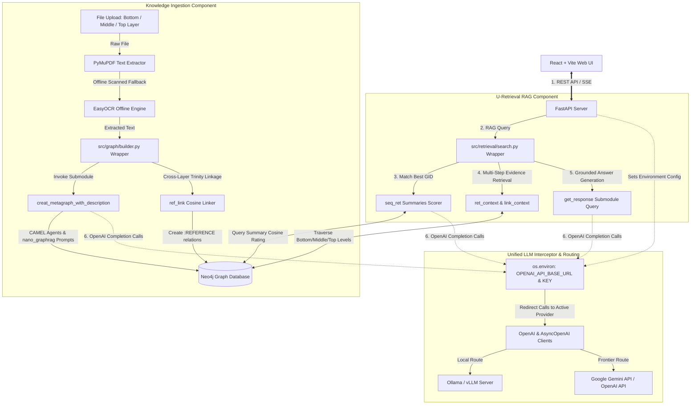

# General-MED-RAG: On-Premises Clinical AI Grounding Engine

General-MED-RAG is an enterprise-grade, privacy-secure, and offline-first Medical Graph RAG (Retrieval-Augmented Generation) system. It is designed based on the **Medical Graph RAG** paper ([arXiv:2408.04187](https://arxiv.org/abs/2408.04187)) and is built as an extensible wrapper around the [ImprintLab/Medical-Graph-RAG](https://github.com/ImprintLab/Medical-Graph-RAG) baseline.

The system is fully optimized for **on-premises deployment on Linux/WSL**, enabling safe medical query answering, easy data ingestion of medical textbooks (EPUB) and clinical reports (PDF), and live interactive visualization of hierarchical medical knowledge graphs.

---

## 🚀 Key Features

*   **U-Retrieval Algorithm**: Executes top-down semantic vector searches (in Qdrant) combined with bottom-up graph traversals (in Neo4j) to compile raw page context, identified clinical keywords, and medical dictionary definitions.
*   **Triple-Linked Trinity Graph**: Automatically structures ingested text into three separate hierarchical levels in Neo4j:
    1.  **Top Level (Chunks)**: Patient records and textbook passages.
    2.  **Medium Level (Entities)**: Identified clinical symptoms, diagnoses, and treatments.
    3.  **Bottom Level (Definitions)**: Verified dictionary explanations (MeSH/UMLS).
*   **Offline Ingestion & OCR Fallback**: Extracted text via PyMuPDF. If a scanned document or low-text image is uploaded, it automatically runs local OCR (EasyOCR) completely offline.
*   **LLM Router**: Seamlessly route queries to Frontier APIs (Gemini, OpenAI) or local LLM instances (Ollama, vLLM) via standard OpenAI-compatible endpoints.
*   **Premium React Web Interface**: Dark-themed, glassmorphic UI displaying real-time chat, upload queues, and custom SVG hierarchical graph diagrams.

---

## 🏗️ Architecture Design & System Flow

The system architecture is structured to support **Dynamic Python Path Injection & Environment Overriding** to fully reuse the original paper's research submodule without codebase duplication.



### Clarifications on Key Components

#### 1. How does LLM Routing connect to RAG?
The `Medical-Graph-RAG` submodule relies heavily on `OpenAI` and `AsyncOpenAI` API clients inside its internal retrieval modules (`retrieve.py`, `utils.py`, `summerize.py`) to summarize queries, score document summaries (`seq_ret`), and generate the final citation-grounded response. 
Instead of rewriting the submodule's Python code, the **LLM Routing Layer** intercepts these calls by dynamically setting `os.environ["OPENAI_API_BASE_URL"]` and `os.environ["OPENAI_API_KEY"]` inside FastAPI. Thus, when the RAG engine issues a completion request, it is automatically routed to our active local LLM (Ollama, vLLM) or frontier LLM (Gemini's OpenAI compatibility layer) without any codebase modifications!

#### 2. Where is the Knowledge Ingestion Component?
The **Knowledge Ingestion Component** is fully integrated within our FastAPI server and bridges the document parser with the submodule graph builders:
1. **User Uploads File** (PDF/EPUB/TXT) along with a designated **Layer** (Bottom: Dictionary, Middle: Guideline, Top: Case Report) from the React UI.
2. **Text Extractor** (`src/ingestion/parser.py`) runs PyMuPDF to extract text, falling back to an on-premises EasyOCR engine if the PDF contains scanned pages.
3. **Graph Builder** (`src/graph/builder.py`) acts as the orchestration gateway. It registers the document with a unique `gid` and invokes the submodule's `creat_metagraph_with_description` to extract entities/relationships using CAMEL agents.
4. **Trinity Linker**: The builder then triggers the cross-layer similarity linker (`ref_link`) to automatically bind related nodes across different layers (e.g., matching a patient symptom on the Top Layer with clinical definitions on the Bottom Layer).

---

## 🧬 Technical Specifications & Integration Details

### 1. Dynamic Python Path Injection
To import local bundled submodule libraries (`camel` and `nano_graphrag`) without complex installations, we append `external/Medical-Graph-RAG` to `sys.path` inside our FastAPI server before importing submodule modules:
```python
import sys
import os
submodule_path = os.path.abspath(os.path.join(os.path.dirname(__file__), "../../external/Medical-Graph-RAG"))
if submodule_path not in sys.path:
    sys.path.append(submodule_path)
```

### 2. OpenAI API Client Overriding
To route all submodule `OpenAI` and `AsyncOpenAI` client calls to local LLMs (Ollama/vLLM) or Frontier APIs (Gemini/OpenAI), we override the `OPENAI_API_BASE_URL` and `OPENAI_API_KEY` dynamically in `os.environ` based on the selected `LLM_PROVIDER`:
*   **Ollama**: `http://host.docker.internal:11434/v1`
*   **vLLM**: Customer-provided endpoint
*   **Gemini**: `https://generativelanguage.googleapis.com/v1beta/openai/` (with API Key)
*   **OpenAI**: `https://api.openai.com/v1`

### 3. Selective 3-Layer (Trinity) Ingestion Management
We extend our FastAPI ingestion backend and React interface to let the user select the target **Trinity Layer**:
*   **Bottom Level**: Medical Dictionaries (MeSH terms, official definitions).
*   **Middle Level**: Clinical guidelines, textbooks, and standards.
*   **Top Level**: Case reports and patient documents.

When files are uploaded, we reuse `creat_metagraph_with_description` to extract entities, and call `ref_link` to build secure `[:REFERENCE]` associations across levels!

### 4. Graph Similarity Computing (GDS Plugin)
We update `NEO4J_PLUGINS` in `docker-compose.yml` to include `gds` (Graph Data Science) along with `apoc`. This supports `gds.similarity.cosine(...)` natively for node-merging queries inside the submodule without any modification!

---

## 📁 Repository Structure

```
General-MED-RAG/
├── .gitmodules                 # Submodule configuration
├── docker-compose.yml          # On-prem docker orchestration
├── requirements.txt            # Python dependencies
├── external/                   # Third-party submodules
│   └── Medical-Graph-RAG/      # Git submodule of original research repo
├── scripts/
│   └── check_spec.py           # On-prem environment and GPU spec validator
├── src/                        # FastAPI Backend Server code
│   ├── config.py               # Environments and configurations
│   ├── api/main.py             # FastAPI entrypoint and REST endpoints
│   ├── ingestion/parser.py     # Offline PDF parser + EasyOCR + Chunker
│   ├── db/                     # Database connectors (Neo4j, Qdrant)
│   ├── graph/builder.py        # Trinity Graph Constructor Wrapper
│   └── llm/client.py           # Unified model router (Ollama / vLLM / Gemini)
└── frontend/                   # React + Vite Web UI
    ├── Dockerfile
    ├── index.html
    ├── src/App.jsx             # Main dashboard, tab layout, and SVG graph renderer
    └── src/index.css           # Premium clinical glassmorphism CSS theme
```

---

## 🛠️ Step-by-Step Installation & Deployment

Follow these instructions to deploy General-MED-RAG on-premises on your Linux machine:

### Step 1: Pre-requisite Spec Validation
Check if your hardware meets the minimum specs required to host database containers and local LLM servers:
```bash
python scripts/check_spec.py
```
*   **Minimum Specs**: 8 CPU Cores, 32GB RAM, 100GB SSD.
*   **Recommended (For Local LLM)**: 16 CPU Cores, 64GB RAM, Nvidia GPU with >= 12GB VRAM.

### Step 2: Install Local LLM (Ollama)
If running offline, download and install Ollama on your Linux host:
```bash
curl -fsSL https://ollama.com/install.sh | sh
```
Start the Ollama service and download the recommended chat and embedding models:
```bash
# Pull chat model
ollama pull llama3:latest

# Pull embedding model
ollama pull nomic-embed-text
```

### Step 3: Launch Databases & App Containers
General-MED-RAG uses Docker-Compose to orchestrate services:
*   **Neo4j** (Graph Database): Stores the hierarchical medical entity-relation graph.
*   **Qdrant** (Vector Store): Stores page embeddings for high-speed top-down searches.
*   **FastAPI Backend**: Orchestrates parser, builders, routers, and search engine.
*   **React Frontend**: Serving the visual dashboard.

Run the launch command:
```bash
docker-compose up -d --build
```

### Step 4: Access the Dashboards
*   **Web Dashboard**: Open [http://localhost:3000](http://localhost:3000) in your web browser.
*   **Neo4j Web GUI**: Open [http://localhost:7474](http://localhost:7474) (Username: `neo4j`, Password: `medragpassword123`) to view and query raw graphs using Cypher.
*   **FastAPI API Docs**: Access Swagger API documentation at [http://localhost:8000/docs](http://localhost:8000/docs).

---

## 🧬 Configuration Management

To use external Frontier models (e.g. Gemini API, which is highly recommended for medical text reasoning) or change database ports, edit the environment variables in your `docker-compose.yml` or create a local `.env` file in the root directory:

```env
# Change LLM Provider
LLM_PROVIDER=gemini # Options: "ollama", "vllm", "gemini", "openai"

# API Keys
GEMINI_API_KEY=your_google_gemini_api_key_here
UMLS_API_KEY=your_umls_license_api_key_here
```

---

## ⚠️ Troubleshooting

1.  **Backend cannot reach Ollama**:
    Ensure Ollama is running on your host machine. On Linux, Docker containers access the host network via `http://host.docker.internal:11434`. This is pre-configured in `docker-compose.yml` under `extra_hosts`.
2.  **Neo4j out of memory**:
    If parsing extremely large medical textbook PDFs (>500 pages), increase container RAM limit or split documents into chapters before uploading.
